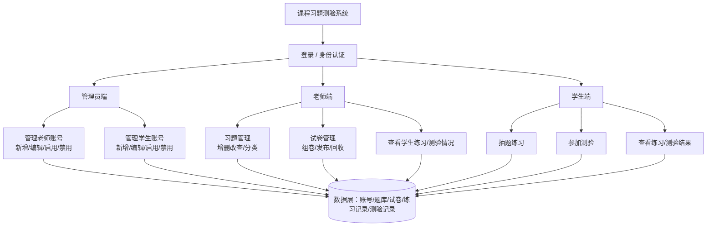

# 课程习题测验系统 —— 项目背景文档

> 小组项目立项材料（一）：项目背景 / 技术选型 / 系统主要业务功能说明

## 一、项目背景

### 1.1 建设背景

随着教育信息化的持续推进，课程配套的练习与测验环节正逐步从传统纸质、线下批改模式向线上化、数据化方向转变。在传统教学模式下，教师出题、组卷、批改与统计工作量大、周期长，学生也缺乏随时随地自主练习、即时获得反馈的途径，教学双方都难以及时掌握真实的学习和掌握情况。

与此同时，课程教学对"以学定教"的需求日益突出：教师希望通过学生练习和测验的数据，了解薄弱知识点，及时调整教学重点；学生也希望通过反复练习、模拟测验来巩固所学内容，并能直观查看自己的答题结果与成绩趋势。在这一背景下，建设一套面向课程教学的"课程习题测验系统"具有明确的现实需求。

### 1.2 现有方式存在的问题

- 出题、组卷、批改主要依赖人工，效率低、重复劳动多，教师负担重；
- 学生练习方式单一，缺少随机抽题、自主练习的便捷入口；
- 练习和测验数据分散甚至缺失，难以沉淀为可分析的学情数据；
- 教师难以及时、直观地掌握全班或个体学生的练习和测验情况，教学反馈滞后；
- 账号权限不分层：若管理员和老师混为一体，账号体系维护与教学内容管理职责混乱，不利于多人协作和权限管控。

### 1.3 项目目标与意义

本项目拟开发一套面向课程教学的习题测验系统，将**管理员、老师、学生**三类角色相互独立、分权登录，具体目标包括：

- 为学生提供随机抽题练习和在线参加测验的能力，并能随时查看练习与测验结果；
- 为老师提供习题与试卷的统一管理能力，覆盖新增、编辑、分类、组卷、发布等操作；
- 为老师提供查看学生练习与测验情况的统计能力，辅助教学决策；
- 为管理员提供独立的账号管理入口，统一维护老师和学生的账号，保证系统账号体系的规范与安全；
- 通过系统化、数据化的方式，提升课程练习测验环节的效率与教学反馈质量。

### 1.4 目标用户

本项目将用户体系拆分为 **管理员、老师、学生** 三类相互独立的角色，各自拥有独立的登录入口和功能空间，职责边界清晰：

| 角色 | 职责说明 |
|---|---|
| **管理员** | 系统账号体系的维护者，负责管理老师和学生的账号（新增、编辑、启用/禁用、重置密码等），不参与出题、组卷或做题 |
| **老师** | 教学内容的管理者，负责习题与试卷相关的管理工作（增删改查、组卷、发布），并查看所教学生的练习/测验情况 |
| **学生** | 系统的使用者，通过系统进行日常抽题练习、参加测验，并查看自己的练习与测验结果 |

三类角色权限互不交叉：管理员不接触教学内容，老师不管理账号体系，学生仅能操作自己的练习与测验数据。

## 二、技术选型

| 类别 | 技术 / 工具 | 选型说明 |
|---|---|---|
| 后端框架 | Spring Boot + Spring MVC | 课堂讲授的核心 Java 后端框架，用于搭建项目架子、实现 RESTful 接口 |
| 持久层框架 | MyBatis | 课堂讲授的数据持久化框架，通过 SQL 映射实现 Java 对象与数据库表的交互 |
| 数据库 | MySQL | 课堂使用的关系型数据库，存储管理员/老师/学生账号、题库、试卷、练习及测验成绩等数据 |
| 登录与权限 | Session + Cookie（原生方式） | 使用 Servlet / Spring MVC 自带的会话机制区分管理员、老师、学生三种角色的登录状态与操作权限，无需额外安全框架 |
| 前端实现 | HTML + CSS + JavaScript（AI 辅助生成）+ Ajax | 无需额外学习新框架，由 AI 辅助生成三端各自的页面，通过 Ajax 调用后端接口获取数据 |
| 构建工具 | Maven | 课堂使用的项目构建与依赖管理工具，统一管理 Spring Boot 相关依赖 |
| 版本管理 | Git | 用于小组成员协作开发、代码版本管理与合并 |
| 原型设计 | 墨刀（Modao） | 用于绘制系统原型草图，辅助梳理页面结构与业务流程 |

总体技术路线为：管理员端、老师端、学生端各自的前端页面由 AI 辅助生成，通过 Ajax 调用后端接口；后端基于 Spring Boot 搭建项目架子，按角色划分接口和权限，自行实现登录鉴权、账号管理、题库管理、试卷管理、练习与测验、成绩统计等业务接口，使用 MyBatis 完成数据持久化，数据统一存储于 MySQL 中，登录状态通过 Session 维护。

## 三、系统主要业务功能说明（草图）

系统按照"管理员端 - 老师端 - 学生端"三端分离的思路设计，三类角色分别登录进入各自独立的功能空间，所有业务数据统一落地到数据层，供账号管理、教学内容管理、练习测验等功能共同使用。主要业务功能架构草图如下：

### 3.1 管理员端主要功能

- 登录 / 身份认证：以管理员身份登录系统；
- 管理老师账号：新增、编辑、启用/禁用老师账号，重置密码；
- 管理学生账号：新增、编辑、启用/禁用学生账号，重置密码。

管理员不涉及具体的教学内容（习题、试卷）与做题过程，只负责账号体系的维护，是系统权限的最高层级。

### 3.2 老师端主要功能

- 登录 / 身份认证：以老师身份登录系统；
- 习题管理：新增、编辑、删除习题，按课程 / 知识点分类；
- 试卷管理：组卷、发布、回收测验试卷；
- 查看学生情况：查看学生练习进度 / 正确率，以及测验成绩与统计分析，为教学调整提供依据。

老师的账号本身由管理员创建和维护，老师登录后只能管理与教学相关的内容，不能管理账号体系。

### 3.3 学生端主要功能

- 登录 / 身份认证：以学生身份登录系统；
- 抽题练习：按课程 / 知识点随机抽取习题进行自主练习；
- 参加测验：参加老师发布的正式测验（限时组卷考试）；
- 查看结果：查看练习的答题解析与测验的成绩、统计信息。

学生的账号同样由管理员创建和维护，学生登录后只能操作与自己相关的练习和测验数据。

### 3.4 数据层

数据层统一承载管理员 / 老师 / 学生账号信息、课程、题库、试卷、练习记录与测验记录等核心数据，为管理员端、老师端、学生端三端功能提供数据支撑，也是第二部分数据库设计（表结构与模拟数据）的基础。
