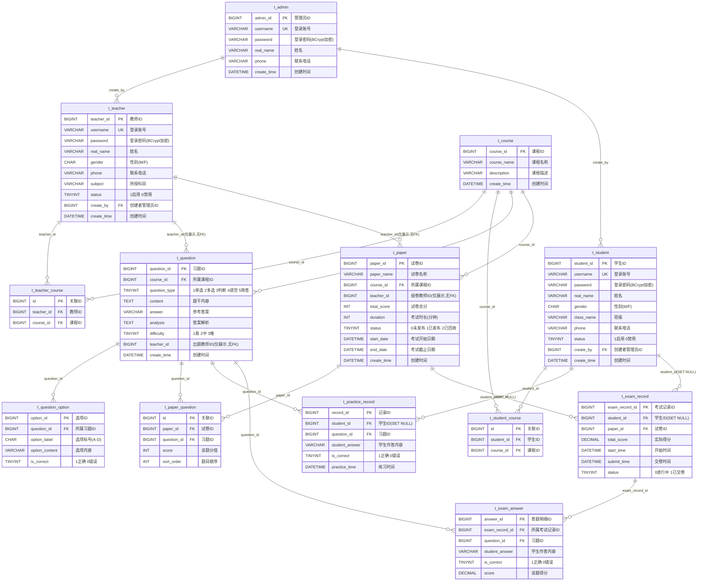

# 课程习题测验系统 —— 数据库设计文档

> 小组项目立项材料（二）：数据库设计（表数量 / 表结构 / 模拟数据）
>
> **对应代码**：`exam-system-backend/src/main/resources/db/schema.sql`

## 一、设计说明

数据库围绕"**管理员 - 老师 - 学生** 三端分离"和"**课程 - 习题 - 试卷 - 练习/测验记录** 业务主线"两条线索设计，共设计 **13 张表**，分为四组：

1. **账号体系（3 张）**：`t_admin`、`t_teacher`、`t_student` —— 三种角色账号相互独立，管理员是教师和学生账号的创建者；
2. **教学内容（5 张）**：`t_course`、`t_question`、`t_question_option`、`t_paper`、`t_paper_question` —— 教师维护课程、题库、试卷；
3. **学习记录（3 张）**：`t_practice_record`、`t_exam_record`、`t_exam_answer` —— 学生的练习和考试行为数据，供教师查看统计；
4. **课程关联（2 张）**：`t_teacher_course`、`t_student_course` —— 课程与教师/学生的多对多关系。

数据库引擎统一使用 `InnoDB`，字符集 `utf8mb4`，主键均为自增 `BIGINT`。

---

## 二、表结构总览

| 序号 | 表名 | 说明 | 所属分组 |
|------|------|------|----------|
| 1 | t_admin | 管理员表 | 账号体系 |
| 2 | t_teacher | 教师表 | 账号体系 |
| 3 | t_student | 学生表 | 账号体系 |
| 4 | t_course | 课程表 | 教学内容 |
| 5 | t_question | 习题表 | 教学内容 |
| 6 | t_question_option | 习题选项表（选择题用） | 教学内容 |
| 7 | t_paper | 试卷表 | 教学内容 |
| 8 | t_paper_question | 试卷-习题关联表 | 教学内容 |
| 9 | t_practice_record | 学生练习记录表 | 学习记录 |
| 10 | t_exam_record | 学生考试记录表（主表） | 学习记录 |
| 11 | t_exam_answer | 学生考试答题明细表 | 学习记录 |
| 12 | t_teacher_course | 教师-课程关联表 | 课程关联 |
| 13 | t_student_course | 学生-课程关联表 | 课程关联 |

---

## 三、ER 关系图

> 下图为数据库的实体-关系（ER）图，使用 Mermaid 语法绘制，可在支持 Mermaid 的 Markdown 渲染器中直接查看。



> **关系图说明：**
> - `||--o{` 表示一对多关系（一条父记录对应零条或多条子记录）
> - `teacher_id` 在 `t_question` 和 `t_paper` 中为展示字段，**无外键约束**——题目和试卷归属于课程而非教师，删除教师不影响其创建的题目和试卷
> - `student_id` 在 `t_practice_record` 和 `t_exam_record` 中设置了 `ON DELETE SET NULL`——删除学生后保留练习/考试记录，student_id 置为 NULL
> - `t_teacher_course` 和 `t_student_course` 为课程分配的多对多中间表

---

## 四、表关系说明

### 4.1 账号体系

- `t_teacher.create_by` 和 `t_student.create_by` → `t_admin.admin_id`，记录账号由哪个管理员创建
- 三种角色账号独立存储（不合并为一张表），因为三种角色的字段不同（教师有 `subject`，学生有 `class_name`，管理员两者都没有）

### 4.2 课程分配（多对多）

- `t_teacher_course`：教师-课程关联表，通过 `teacher_id` + `course_id` 唯一索引防止重复分配
- `t_student_course`：学生-课程关联表，通过 `student_id` + `course_id` 唯一索引防止重复选课
- 课程分配决定权限：教师只能看所教课程的题目/试卷，学生只能看所选课程的练习/考试

### 4.3 教学内容

- `t_question.course_id` → `t_course.course_id`（FK），题目归属于课程
- `t_question.teacher_id`：出题人记录，**无 FK 约束**，仅展示用
- `t_question_option.question_id` → `t_question.question_id`（FK），仅选择题（单选/多选）有选项记录
- `t_paper.course_id` → `t_course.course_id`（FK），试卷归属于课程
- `t_paper.teacher_id`：组卷人记录，**无 FK 约束**，仅展示用
- `t_paper.start_date` / `t_paper.end_date`：考试时间窗口，可为 NULL（无时间限制）
- `t_paper_question` 是 `t_paper` 与 `t_question` 的多对多关联表

### 4.4 学习记录

- `t_practice_record`：每次练习提交记录一条，通过 `student_id`（`ON DELETE SET NULL`）和 `question_id`（FK）关联
- `t_exam_record`：每次考试一条主记录，通过 `student_id`（`ON DELETE SET NULL`）和 `paper_id`（FK）关联
- `t_exam_answer`：考试中每道题的作答明细，通过 `exam_record_id`（FK）和 `question_id`（FK）关联

---

## 五、关键设计决策

### 5.1 为什么 `teacher_id` 不加外键约束？

题目和试卷属于**课程资产**，不属于教师个人。如果教师离职：
- 加了 FK：删除教师时必须处理其题目/试卷（要么级联删除丢失数据，要么 SET NULL 丢失出处信息）
- 不加 FK：题目/试卷保留在课程中，同课程的其他教师可继续使用，`teacher_id` 仅作为"谁创建的"记录

代码中的权限过滤通过 `t_teacher_course` 查课程 ID 列表，再 `WHERE course_id IN (...)` 实现，不依赖 `teacher_id`。

### 5.2 为什么学生记录用 `ON DELETE SET NULL`？

删除学生时，其练习和考试记录仍有统计价值（如计算某道题的整体正确率、某试卷的平均分）。`SET NULL` 保留记录数据，仅丢失学生身份关联。这比 `CASCADE` 删除所有历史数据或 `RESTRICT` 阻止删除学生都更合理。

### 5.3 为什么判断题不存选项？

判断题只有"对""错"两个固定选项，如果每道判断题都在 `t_question_option` 存两条记录，是纯粹的数据冗余。代码在加载题目时判断 `question_type == 3`，若数据库无选项则自动生成"对"/"错"两个默认选项（`PracticeServiceImpl.generatePractice()` 和 `ExamServiceImpl.getExamQuestions()` 中实现）。

### 5.4 三种角色为什么分三张表？

三种角色的字段不同（教师有 `subject`、学生有 `class_name`、管理员两者都没有），合并为一张表会产生大量 NULL 字段。分开存储字段更清晰，登录时也不需要 `role` 字段区分——从哪张表查到就在哪个角色。缺点是多表查询时需要 `UNION`，但本项目三种角色各自独立，无跨角色查询需求。

---

## 六、详细表设计与建表语句

> 以下 DDL 与 `resources/db/schema.sql` 保持一致。所有建表语句使用 `CREATE TABLE IF NOT EXISTS`，可重复执行。

### 6.1 t_admin（管理员表）

| 字段名 | 类型 | 约束 | 说明 |
|--------|------|------|------|
| admin_id | BIGINT | PK, AUTO_INCREMENT | 管理员ID |
| username | VARCHAR(50) | NOT NULL, UNIQUE | 登录账号 |
| password | VARCHAR(100) | NOT NULL | 登录密码（BCrypt加密） |
| real_name | VARCHAR(50) | | 姓名 |
| phone | VARCHAR(20) | | 联系电话 |
| create_time | DATETIME | DEFAULT CURRENT_TIMESTAMP | 创建时间 |

```sql
CREATE TABLE IF NOT EXISTS t_admin (
    admin_id    BIGINT AUTO_INCREMENT PRIMARY KEY COMMENT '管理员ID',
    username    VARCHAR(50)  NOT NULL UNIQUE COMMENT '登录账号',
    password    VARCHAR(100) NOT NULL COMMENT '登录密码（BCrypt加密）',
    real_name   VARCHAR(50)  COMMENT '姓名',
    phone       VARCHAR(20)  COMMENT '联系电话',
    create_time DATETIME DEFAULT CURRENT_TIMESTAMP COMMENT '创建时间'
) ENGINE=InnoDB DEFAULT CHARSET=utf8mb4 COMMENT='管理员表';
```

### 6.2 t_teacher（教师表）

| 字段名 | 类型 | 约束 | 说明 |
|--------|------|------|------|
| teacher_id | BIGINT | PK, AUTO_INCREMENT | 教师ID |
| username | VARCHAR(50) | NOT NULL, UNIQUE | 登录账号 |
| password | VARCHAR(100) | NOT NULL | 登录密码（BCrypt加密） |
| real_name | VARCHAR(50) | | 姓名 |
| gender | CHAR(1) | | 性别（M/F） |
| phone | VARCHAR(20) | | 联系电话 |
| subject | VARCHAR(50) | | 所授科目（展示用，实际课程权限看 t_teacher_course） |
| status | TINYINT | DEFAULT 1 | 状态（1启用 0禁用） |
| create_by | BIGINT | FK → t_admin.admin_id | 创建该账号的管理员 |
| create_time | DATETIME | DEFAULT CURRENT_TIMESTAMP | 创建时间 |

```sql
CREATE TABLE IF NOT EXISTS t_teacher (
    teacher_id  BIGINT AUTO_INCREMENT PRIMARY KEY COMMENT '教师ID',
    username    VARCHAR(50)  NOT NULL UNIQUE COMMENT '登录账号',
    password    VARCHAR(100) NOT NULL COMMENT '登录密码（BCrypt加密）',
    real_name   VARCHAR(50)  COMMENT '姓名',
    gender      CHAR(1)      COMMENT '性别（M/F）',
    phone       VARCHAR(20)  COMMENT '联系电话',
    subject     VARCHAR(50)  COMMENT '所授科目',
    status      TINYINT DEFAULT 1 COMMENT '状态：1启用 0禁用',
    create_by   BIGINT       COMMENT '创建该账号的管理员ID',
    create_time DATETIME DEFAULT CURRENT_TIMESTAMP COMMENT '创建时间',
    CONSTRAINT fk_teacher_admin FOREIGN KEY (create_by) REFERENCES t_admin (admin_id)
) ENGINE=InnoDB DEFAULT CHARSET=utf8mb4 COMMENT='教师表';
```

### 6.3 t_student（学生表）

| 字段名 | 类型 | 约束 | 说明 |
|--------|------|------|------|
| student_id | BIGINT | PK, AUTO_INCREMENT | 学生ID |
| username | VARCHAR(50) | NOT NULL, UNIQUE | 登录账号 |
| password | VARCHAR(100) | NOT NULL | 登录密码（BCrypt加密） |
| real_name | VARCHAR(50) | | 姓名 |
| gender | CHAR(1) | | 性别（M/F） |
| class_name | VARCHAR(50) | | 班级 |
| phone | VARCHAR(20) | | 联系电话 |
| status | TINYINT | DEFAULT 1 | 状态（1启用 0禁用） |
| create_by | BIGINT | FK → t_admin.admin_id | 创建该账号的管理员 |
| create_time | DATETIME | DEFAULT CURRENT_TIMESTAMP | 创建时间 |

```sql
CREATE TABLE IF NOT EXISTS t_student (
    student_id  BIGINT AUTO_INCREMENT PRIMARY KEY COMMENT '学生ID',
    username    VARCHAR(50)  NOT NULL UNIQUE COMMENT '登录账号',
    password    VARCHAR(100) NOT NULL COMMENT '登录密码（BCrypt加密）',
    real_name   VARCHAR(50)  COMMENT '姓名',
    gender      CHAR(1)      COMMENT '性别（M/F）',
    class_name  VARCHAR(50)  COMMENT '班级',
    phone       VARCHAR(20)  COMMENT '联系电话',
    status      TINYINT DEFAULT 1 COMMENT '状态：1启用 0禁用',
    create_by   BIGINT       COMMENT '创建该账号的管理员ID',
    create_time DATETIME DEFAULT CURRENT_TIMESTAMP COMMENT '创建时间',
    CONSTRAINT fk_student_admin FOREIGN KEY (create_by) REFERENCES t_admin (admin_id)
) ENGINE=InnoDB DEFAULT CHARSET=utf8mb4 COMMENT='学生表';
```

### 6.4 t_course（课程表）

| 字段名 | 类型 | 约束 | 说明 |
|--------|------|------|------|
| course_id | BIGINT | PK, AUTO_INCREMENT | 课程ID |
| course_name | VARCHAR(100) | NOT NULL | 课程名称 |
| description | VARCHAR(255) | | 课程描述 |
| create_time | DATETIME | DEFAULT CURRENT_TIMESTAMP | 创建时间 |

```sql
CREATE TABLE IF NOT EXISTS t_course (
    course_id   BIGINT AUTO_INCREMENT PRIMARY KEY COMMENT '课程ID',
    course_name VARCHAR(100) NOT NULL COMMENT '课程名称',
    description VARCHAR(255) COMMENT '课程描述',
    create_time DATETIME DEFAULT CURRENT_TIMESTAMP COMMENT '创建时间'
) ENGINE=InnoDB DEFAULT CHARSET=utf8mb4 COMMENT='课程表';
```

### 6.5 t_question（习题表）

| 字段名 | 类型 | 约束 | 说明 |
|--------|------|------|------|
| question_id | BIGINT | PK, AUTO_INCREMENT | 习题ID |
| course_id | BIGINT | NOT NULL, FK → t_course | 所属课程ID |
| question_type | TINYINT | NOT NULL | 题型：1单选 2多选 3判断 4填空 5简答 |
| content | TEXT | NOT NULL | 题干内容 |
| answer | VARCHAR(255) | | 参考答案 |
| analysis | TEXT | | 答案解析 |
| difficulty | TINYINT | DEFAULT 1 | 难度：1易 2中 3难 |
| teacher_id | BIGINT | NULL（无FK） | 出题教师ID，仅展示不作权限过滤 |
| create_time | DATETIME | DEFAULT CURRENT_TIMESTAMP | 创建时间 |

```sql
CREATE TABLE IF NOT EXISTS t_question (
    question_id   BIGINT AUTO_INCREMENT PRIMARY KEY COMMENT '习题ID',
    course_id     BIGINT      NOT NULL COMMENT '所属课程ID',
    question_type TINYINT     NOT NULL COMMENT '题型：1单选 2多选 3判断 4填空 5简答',
    content       TEXT        NOT NULL COMMENT '题干内容',
    answer        VARCHAR(255) COMMENT '参考答案',
    analysis      TEXT        COMMENT '答案解析',
    difficulty    TINYINT DEFAULT 1 COMMENT '难度：1易 2中 3难',
    teacher_id    BIGINT      NULL COMMENT '出题教师ID（仅展示，不作为权限过滤）',
    create_time   DATETIME DEFAULT CURRENT_TIMESTAMP COMMENT '创建时间',
    CONSTRAINT fk_question_course FOREIGN KEY (course_id) REFERENCES t_course (course_id)
) ENGINE=InnoDB DEFAULT CHARSET=utf8mb4 COMMENT='习题表';
```

### 6.6 t_question_option（习题选项表）

| 字段名 | 类型 | 约束 | 说明 |
|--------|------|------|------|
| option_id | BIGINT | PK, AUTO_INCREMENT | 选项ID |
| question_id | BIGINT | NOT NULL, FK → t_question | 所属习题ID |
| option_label | CHAR(1) | NOT NULL | 选项标号（A/B/C/D） |
| option_content | VARCHAR(255) | NOT NULL | 选项内容 |
| is_correct | TINYINT | DEFAULT 0 | 是否为正确答案：1是 0否 |

```sql
CREATE TABLE IF NOT EXISTS t_question_option (
    option_id      BIGINT AUTO_INCREMENT PRIMARY KEY COMMENT '选项ID',
    question_id    BIGINT       NOT NULL COMMENT '所属习题ID',
    option_label   CHAR(1)      NOT NULL COMMENT '选项标号：A/B/C/D',
    option_content VARCHAR(255) NOT NULL COMMENT '选项内容',
    is_correct     TINYINT DEFAULT 0 COMMENT '是否为正确答案：1是 0否',
    CONSTRAINT fk_option_question FOREIGN KEY (question_id) REFERENCES t_question (question_id)
) ENGINE=InnoDB DEFAULT CHARSET=utf8mb4 COMMENT='习题选项表（选择题用）';
```

### 6.7 t_paper（试卷表）

| 字段名 | 类型 | 约束 | 说明 |
|--------|------|------|------|
| paper_id | BIGINT | PK, AUTO_INCREMENT | 试卷ID |
| paper_name | VARCHAR(100) | NOT NULL | 试卷名称 |
| course_id | BIGINT | NOT NULL, FK → t_course | 所属课程ID |
| teacher_id | BIGINT | NULL（无FK） | 组卷教师ID，仅展示不作权限过滤 |
| total_score | INT | DEFAULT 100 | 试卷总分 |
| duration | INT | DEFAULT 60 | 考试时长（分钟） |
| status | TINYINT | DEFAULT 0 | 状态：0未发布 1已发布 2已回收 |
| start_date | DATETIME | NULL | 考试开始日期（NULL=无时间限制） |
| end_date | DATETIME | NULL | 考试截止日期（NULL=无时间限制） |
| create_time | DATETIME | DEFAULT CURRENT_TIMESTAMP | 创建时间 |

```sql
CREATE TABLE IF NOT EXISTS t_paper (
    paper_id    BIGINT AUTO_INCREMENT PRIMARY KEY COMMENT '试卷ID',
    paper_name  VARCHAR(100) NOT NULL COMMENT '试卷名称',
    course_id   BIGINT       NOT NULL COMMENT '所属课程ID',
    teacher_id  BIGINT       NULL COMMENT '组卷教师ID（仅展示，不作为权限过滤）',
    total_score INT DEFAULT 100 COMMENT '试卷总分',
    duration    INT DEFAULT 60 COMMENT '考试时长（分钟）',
    status      TINYINT DEFAULT 0 COMMENT '状态：0未发布 1已发布 2已回收',
    start_date  DATETIME    NULL        COMMENT '考试开始日期（学生可答题的起始时间）',
    end_date    DATETIME    NULL        COMMENT '考试截止日期（学生答题的截止时间）',
    create_time DATETIME DEFAULT CURRENT_TIMESTAMP COMMENT '创建时间',
    CONSTRAINT fk_paper_course FOREIGN KEY (course_id) REFERENCES t_course (course_id)
) ENGINE=InnoDB DEFAULT CHARSET=utf8mb4 COMMENT='试卷表';
```

### 6.8 t_paper_question（试卷-习题关联表）

| 字段名 | 类型 | 约束 | 说明 |
|--------|------|------|------|
| id | BIGINT | PK, AUTO_INCREMENT | 关联ID |
| paper_id | BIGINT | NOT NULL, FK → t_paper | 试卷ID |
| question_id | BIGINT | NOT NULL, FK → t_question | 习题ID |
| score | INT | DEFAULT 10 | 该题分值 |
| sort_order | INT | DEFAULT 1 | 题目顺序 |

```sql
CREATE TABLE IF NOT EXISTS t_paper_question (
    id          BIGINT AUTO_INCREMENT PRIMARY KEY COMMENT '关联ID',
    paper_id    BIGINT NOT NULL COMMENT '试卷ID',
    question_id BIGINT NOT NULL COMMENT '习题ID',
    score       INT DEFAULT 10 COMMENT '该题分值',
    sort_order  INT DEFAULT 1 COMMENT '题目顺序',
    CONSTRAINT fk_pq_paper    FOREIGN KEY (paper_id)    REFERENCES t_paper (paper_id),
    CONSTRAINT fk_pq_question FOREIGN KEY (question_id) REFERENCES t_question (question_id)
) ENGINE=InnoDB DEFAULT CHARSET=utf8mb4 COMMENT='试卷-习题关联表';
```

### 6.9 t_practice_record（学生练习记录表）

| 字段名 | 类型 | 约束 | 说明 |
|--------|------|------|------|
| record_id | BIGINT | PK, AUTO_INCREMENT | 记录ID |
| student_id | BIGINT | NULL, FK → t_student (SET NULL) | 学生ID |
| question_id | BIGINT | NOT NULL, FK → t_question | 习题ID |
| student_answer | VARCHAR(255) | | 学生作答内容 |
| is_correct | TINYINT | | 是否正确：1正确 0错误 |
| practice_time | DATETIME | DEFAULT CURRENT_TIMESTAMP | 练习时间 |

```sql
CREATE TABLE IF NOT EXISTS t_practice_record (
    record_id      BIGINT AUTO_INCREMENT PRIMARY KEY COMMENT '记录ID',
    student_id     BIGINT NULL COMMENT '学生ID（删除学生时置NULL，保留记录）',
    question_id    BIGINT NOT NULL COMMENT '习题ID',
    student_answer VARCHAR(255) COMMENT '学生作答内容',
    is_correct     TINYINT COMMENT '是否正确：1正确 0错误',
    practice_time  DATETIME DEFAULT CURRENT_TIMESTAMP COMMENT '练习时间',
    CONSTRAINT fk_practice_student  FOREIGN KEY (student_id)  REFERENCES t_student (student_id) ON DELETE SET NULL,
    CONSTRAINT fk_practice_question FOREIGN KEY (question_id) REFERENCES t_question (question_id)
) ENGINE=InnoDB DEFAULT CHARSET=utf8mb4 COMMENT='学生练习记录表';
```

### 6.10 t_exam_record（学生考试记录表，主表）

| 字段名 | 类型 | 约束 | 说明 |
|--------|------|------|------|
| exam_record_id | BIGINT | PK, AUTO_INCREMENT | 考试记录ID |
| student_id | BIGINT | NULL, FK → t_student (SET NULL) | 学生ID |
| paper_id | BIGINT | NOT NULL, FK → t_paper | 试卷ID |
| total_score | DECIMAL(5,1) | | 本次考试实际得分 |
| start_time | DATETIME | | 开始时间 |
| submit_time | DATETIME | | 交卷时间 |
| status | TINYINT | DEFAULT 0 | 状态：0进行中 1已交卷 |

```sql
CREATE TABLE IF NOT EXISTS t_exam_record (
    exam_record_id BIGINT AUTO_INCREMENT PRIMARY KEY COMMENT '考试记录ID',
    student_id     BIGINT NULL COMMENT '学生ID（删除学生时置NULL，保留记录）',
    paper_id       BIGINT NOT NULL COMMENT '试卷ID',
    total_score    DECIMAL(5,1) COMMENT '本次考试实际得分',
    start_time     DATETIME COMMENT '开始时间',
    submit_time    DATETIME COMMENT '交卷时间',
    status         TINYINT DEFAULT 0 COMMENT '状态：0进行中 1已交卷',
    CONSTRAINT fk_exam_student FOREIGN KEY (student_id) REFERENCES t_student (student_id) ON DELETE SET NULL,
    CONSTRAINT fk_exam_paper   FOREIGN KEY (paper_id)   REFERENCES t_paper (paper_id)
) ENGINE=InnoDB DEFAULT CHARSET=utf8mb4 COMMENT='学生考试记录表（主表）';
```

### 6.11 t_exam_answer（学生考试答题明细表）

| 字段名 | 类型 | 约束 | 说明 |
|--------|------|------|------|
| answer_id | BIGINT | PK, AUTO_INCREMENT | 答题明细ID |
| exam_record_id | BIGINT | NOT NULL, FK → t_exam_record | 所属考试记录ID |
| question_id | BIGINT | NOT NULL, FK → t_question | 习题ID |
| student_answer | VARCHAR(255) | | 学生作答内容 |
| is_correct | TINYINT | | 是否正确：1正确 0错误 |
| score | DECIMAL(5,1) | | 该题得分 |

```sql
CREATE TABLE IF NOT EXISTS t_exam_answer (
    answer_id      BIGINT AUTO_INCREMENT PRIMARY KEY COMMENT '答题明细ID',
    exam_record_id BIGINT NOT NULL COMMENT '所属考试记录ID',
    question_id    BIGINT NOT NULL COMMENT '习题ID',
    student_answer VARCHAR(255) COMMENT '学生作答内容',
    is_correct     TINYINT COMMENT '是否正确：1正确 0错误',
    score          DECIMAL(5,1) COMMENT '该题得分',
    CONSTRAINT fk_answer_exam     FOREIGN KEY (exam_record_id) REFERENCES t_exam_record (exam_record_id),
    CONSTRAINT fk_answer_question FOREIGN KEY (question_id)     REFERENCES t_question (question_id)
) ENGINE=InnoDB DEFAULT CHARSET=utf8mb4 COMMENT='学生考试答题明细表';
```

### 6.12 t_teacher_course（教师-课程关联表）

| 字段名 | 类型 | 约束 | 说明 |
|--------|------|------|------|
| id | BIGINT | PK, AUTO_INCREMENT | 关联ID |
| teacher_id | BIGINT | NOT NULL, FK → t_teacher | 教师ID |
| course_id | BIGINT | NOT NULL, FK → t_course | 课程ID |

```sql
CREATE TABLE IF NOT EXISTS t_teacher_course (
    id         BIGINT AUTO_INCREMENT PRIMARY KEY COMMENT '关联ID',
    teacher_id BIGINT NOT NULL COMMENT '教师ID',
    course_id  BIGINT NOT NULL COMMENT '课程ID',
    UNIQUE KEY uk_teacher_course (teacher_id, course_id),
    CONSTRAINT fk_tc_teacher FOREIGN KEY (teacher_id) REFERENCES t_teacher (teacher_id),
    CONSTRAINT fk_tc_course  FOREIGN KEY (course_id)  REFERENCES t_course (course_id)
) ENGINE=InnoDB DEFAULT CHARSET=utf8mb4 COMMENT='教师-课程关联表';
```

### 6.13 t_student_course（学生-课程关联表）

| 字段名 | 类型 | 约束 | 说明 |
|--------|------|------|------|
| id | BIGINT | PK, AUTO_INCREMENT | 关联ID |
| student_id | BIGINT | NOT NULL, FK → t_student | 学生ID |
| course_id | BIGINT | NOT NULL, FK → t_course | 课程ID |

```sql
CREATE TABLE IF NOT EXISTS t_student_course (
    id         BIGINT AUTO_INCREMENT PRIMARY KEY COMMENT '关联ID',
    student_id BIGINT NOT NULL COMMENT '学生ID',
    course_id  BIGINT NOT NULL COMMENT '课程ID',
    UNIQUE KEY uk_student_course (student_id, course_id),
    CONSTRAINT fk_sc_student FOREIGN KEY (student_id) REFERENCES t_student (student_id),
    CONSTRAINT fk_sc_course  FOREIGN KEY (course_id)  REFERENCES t_course (course_id)
) ENGINE=InnoDB DEFAULT CHARSET=utf8mb4 COMMENT='学生-课程关联表';
```

---

## 七、外键约束汇总

| 子表 | 外键字段 | 父表 | 删除策略 | 说明 |
|------|---------|------|---------|------|
| t_teacher | create_by | t_admin | RESTRICT | 管理员被引用时不可删除 |
| t_student | create_by | t_admin | RESTRICT | 管理员被引用时不可删除 |
| t_question | course_id | t_course | RESTRICT | 课程下有题目时不可删除 |
| t_question_option | question_id | t_question | (默认RESTRICT) | — |
| t_paper | course_id | t_course | RESTRICT | 课程下有试卷时不可删除 |
| t_paper_question | paper_id | t_paper | (默认RESTRICT) | — |
| t_paper_question | question_id | t_question | (默认RESTRICT) | 删除题目前需先删关联 |
| t_practice_record | student_id | t_student | **SET NULL** | 删除学生保留记录 |
| t_practice_record | question_id | t_question | (默认RESTRICT) | 删除题目前需先删记录 |
| t_exam_record | student_id | t_student | **SET NULL** | 删除学生保留记录 |
| t_exam_record | paper_id | t_paper | (默认RESTRICT) | — |
| t_exam_answer | exam_record_id | t_exam_record | (默认RESTRICT) | — |
| t_exam_answer | question_id | t_question | (默认RESTRICT) | 删除题目前需先删答案 |
| t_teacher_course | teacher_id | t_teacher | (默认RESTRICT) | — |
| t_teacher_course | course_id | t_course | (默认RESTRICT) | — |
| t_student_course | student_id | t_student | (默认RESTRICT) | — |
| t_student_course | course_id | t_course | (默认RESTRICT) | — |

> **注意**：`t_question.teacher_id` 和 `t_paper.teacher_id` **无外键约束**，不在上表中。`t_practice_record.student_id` 和 `t_exam_record.student_id` 使用 `ON DELETE SET NULL`。

---

## 八、索引汇总

| 表名 | 索引类型 | 字段 | 说明 |
|------|---------|------|------|
| t_admin | UNIQUE | username | 登录账号唯一 |
| t_teacher | UNIQUE | username | 登录账号唯一 |
| t_student | UNIQUE | username | 登录账号唯一 |
| t_teacher_course | UNIQUE | (teacher_id, course_id) | 防止重复分配 |
| t_student_course | UNIQUE | (student_id, course_id) | 防止重复选课 |

> 其他查询索引（如按课程筛选题目、按学生查记录等）均依赖外键约束自带的索引。若后续数据量增大，可针对高频查询条件（如 `question_type`、`difficulty`、`create_time`）单独建索引。

---

## 九、模拟数据

> **注意**：模拟数据仅供理解数据关系。实际运行中，种子数据由 `DataInitializer.java` 在首次启动时自动初始化（密码为 BCrypt 加密），默认账号如下表。

### 9.1 默认账号

| 角色 | 用户名 | 密码 | 说明 |
|------|--------|------|------|
| 管理员 | admin | 123456 | 系统管理员，超级用户 |
| 教师 | teacher_wang | 123456 | 王老师，教 Java程序设计 |
| 教师 | teacher_li | 123456 | 李老师，教 数据库原理 |
| 学生 | stu_zhang | 123456 | 张三，软件2101班 |
| 学生 | stu_liu | 123456 | 刘芳，软件2101班 |
| 学生 | stu_chen | 123456 | 陈明，软件2102班 |

### 9.2 课程分配

| 课程 | 教师 | 学生 |
|------|------|------|
| Java程序设计 | teacher_wang | stu_zhang, stu_liu, stu_chen |
| 数据库原理 | teacher_li | stu_zhang, stu_liu |

### 9.3 示例数据 SQL

以下按依赖顺序（先父表后子表）插入示例数据。实际密码为 BCrypt 加密，此处用 `123456` 示意。

```sql
-- ===== 1. 管理员 =====
INSERT INTO t_admin (admin_id, username, password, real_name, phone) VALUES
(1, 'admin', '$2a$10$...', '系统管理员', '13800000000');

-- ===== 2. 教师 =====
INSERT INTO t_teacher (teacher_id, username, password, real_name, gender, phone, subject, status, create_by) VALUES
(1, 'teacher_wang', '$2a$10$...', '王老师', 'F', '13800000001', 'Java程序设计', 1, 1),
(2, 'teacher_li',   '$2a$10$...', '李老师', 'M', '13800000002', '数据库原理',   1, 1);

-- ===== 3. 学生 =====
INSERT INTO t_student (student_id, username, password, real_name, gender, class_name, phone, status, create_by) VALUES
(1, 'stu_zhang', '$2a$10$...', '张三', 'M', '软件2101班', '13900000001', 1, 1),
(2, 'stu_liu',   '$2a$10$...', '刘芳', 'F', '软件2101班', '13900000002', 1, 1),
(3, 'stu_chen',  '$2a$10$...', '陈明', 'M', '软件2102班', '13900000003', 1, 1);

-- ===== 4. 课程 =====
INSERT INTO t_course (course_id, course_name, description) VALUES
(1, 'Java程序设计', '面向对象编程与Java基础语法'),
(2, '数据库原理',   '关系型数据库设计与SQL语言');

-- ===== 5. 课程分配（多对多） =====
INSERT INTO t_teacher_course (teacher_id, course_id) VALUES
(1, 1),   -- 王老师 → Java程序设计
(2, 2);   -- 李老师 → 数据库原理

INSERT INTO t_student_course (student_id, course_id) VALUES
(1, 1), (1, 2),   -- 张三 → Java, 数据库
(2, 1), (2, 2),   -- 刘芳 → Java, 数据库
(3, 1);             -- 陈明 → Java

-- ===== 6. 习题 =====
INSERT INTO t_question (question_id, course_id, question_type, content, answer, analysis, difficulty, teacher_id) VALUES
(1, 1, 1, 'Java中定义一个类使用以下哪个关键字？', 'A', 'class 是Java中定义类的关键字。', 1, 1),
(2, 1, 3, 'Java是一种解释型语言。', '对', 'Java先编译为字节码，再由JVM解释执行，兼具编译与解释特性。', 2, 1),
(3, 2, 1, '在MySQL中，用于唯一标识表中一行数据的约束是？', 'B', '主键（PRIMARY KEY）用于唯一标识一行记录。', 1, 2);

-- ===== 7. 习题选项（单选/多选用，判断题不存选项） =====
INSERT INTO t_question_option (question_id, option_label, option_content, is_correct) VALUES
(1, 'A', 'class',  1),
(1, 'B', 'struct', 0),
(1, 'C', 'define', 0),
(1, 'D', 'object', 0),
(3, 'A', '外键', 0),
(3, 'B', '主键', 1),
(3, 'C', '索引', 0),
(3, 'D', '视图', 0);

-- ===== 8. 试卷 =====
INSERT INTO t_paper (paper_id, paper_name, course_id, teacher_id, total_score, duration, status, start_date, end_date) VALUES
(1, 'Java程序设计 第一章测验', 1, 1, 100, 45, 1, '2026-07-01 00:00:00', '2026-12-31 23:59:59');

-- ===== 9. 试卷-习题关联 =====
INSERT INTO t_paper_question (paper_id, question_id, score, sort_order) VALUES
(1, 1, 50, 1),
(1, 2, 50, 2);

-- ===== 10. 练习记录 =====
INSERT INTO t_practice_record (student_id, question_id, student_answer, is_correct, practice_time) VALUES
(1, 1, 'A', 1, '2026-07-10 19:20:00'),
(1, 3, 'B', 1, '2026-07-10 19:22:00'),
(2, 2, '错', 0, '2026-07-11 20:05:00');

-- ===== 11. 考试记录（主表） =====
INSERT INTO t_exam_record (exam_record_id, student_id, paper_id, total_score, start_time, submit_time, status) VALUES
(1, 1, 1, 100.0, '2026-07-12 09:00:00', '2026-07-12 09:35:00', 1),
(2, 2, 1, 50.0,  '2026-07-12 09:02:00', '2026-07-12 09:40:00', 1);

-- ===== 12. 考试答题明细 =====
INSERT INTO t_exam_answer (exam_record_id, question_id, student_answer, is_correct, score) VALUES
(1, 1, 'A',  1, 50.0),
(1, 2, '对', 1, 50.0),
(2, 1, 'A',  1, 50.0),
(2, 2, '错', 0, 0.0);
```

---

## 十、后续可扩展方向

- 若题量增大，可增加 **知识点表**（`t_knowledge_point`）并与题目做多对多关联，实现按知识点的分类统计和薄弱项分析；
- 若需要支持简答题人工批阅，可在 `t_exam_answer` 增加 `check_by`（批改人）、`check_time`（批改时间）、`teacher_comment`（教师评语）字段；
- 若需要操作审计，可增加 **操作日志表**（`t_operation_log`），记录管理员的关键操作（增删账号、分配课程等）；
- 若需要通知系统（v2.0 规划），需新增 `t_notification` 和 `t_notification_read` 两张表；
- 若需要错题本（v2.0 规划），需新增 `t_wrong_book` 表追踪错误次数和掌握状态。
